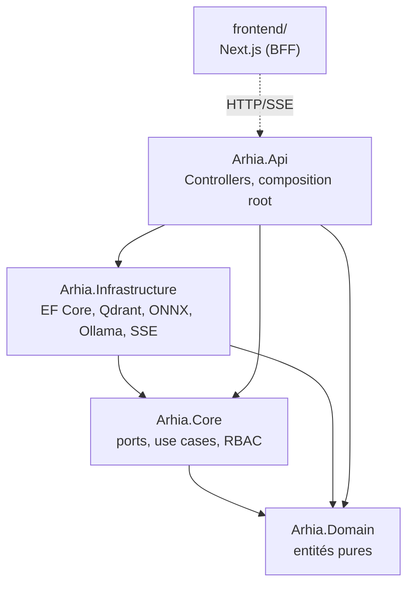

# arhia — Assistant RH agentique

Agent conversationnel d'onboarding et d'offboarding, avec pipeline RAG (Retrieval-Augmented
Generation) et orchestration LLM locale. Projet de fin d'études (stage été 2026) : conception
fonctionnelle, architecture technique, pipeline IA et sécurité des accès, jusqu'à un prototype
opérationnel démontrable de bout en bout.

## Aperçu

- **Interface authentifiée par rôle** : page de garde publique, connexion/inscription, puis un
  tableau de bord adapté au rôle connecté (Collaborateur/RH/Admin), des pages Dossiers et
  Collaborateurs, et un chat conversationnel — pas seulement un chat comme point d'entrée unique.
- **Réponses sourcées** : chaque réponse documentaire cite les documents dont elle est extraite ;
  l'agent refuse explicitement plutôt que d'inventer quand rien de pertinent n'est trouvé
  (anti-hallucination encodée en code, pas seulement dans le prompt).
- **Strictement informatif** : aucune action destructrice ou d'écriture n'est jamais déclenchée
  par l'agent — lecture seule sur les données de statut, écritures réservées aux endpoints
  métier classiques avec contrôle RBAC.
- **RBAC à 3 rôles avec portée** : Collaborateur (ses données), RH (son pôle uniquement), Admin/
  Qualité (portée globale, circuit de validation des templates).
- **Temps réel** : chat en streaming token par token et barre de notifications, tous deux via
  Server-Sent Events (SSE), à travers un pattern BFF qui ne laisse jamais le token
  d'authentification atteindre le navigateur en clair.

## Architecture

Architecture hexagonale (ports & adaptateurs) — dépendance à sens unique, jamais vers le haut :



Détail complet, diagrammes de flux et arborescence cible : [`docs/ARCHITECTURE.md`](docs/ARCHITECTURE.md).

### Pipeline RAG (4 phases, toutes obligatoires)

`Chunking structurel + recouvrement` → `Embedding ONNX multilingue (768d)` → `Recherche Qdrant
(ANN/HNSW, cosinus)` → `Reranking cross-encoder (BAAI/bge-reranker-v2-m3)`

### Orchestration conversationnelle

`Router (Ollama, phi4-mini:3.8b)` classe l'intention (documentaire / statut de dossier / hors
périmètre) → `Generator (Ollama)` écrit la réponse, sourcée si le RAG a été utilisé. Toute sortie
du Router qui ne matche pas exactement l'un des trois cas retombe par défaut sur hors périmètre
(fail-safe, pas fail-open).

## Stack technique

| Composant | Choix |
|---|---|
| Backend | .NET 8, ASP.NET Core, EF Core |
| Frontend | Next.js 15 (BFF, cookie httpOnly), TailwindCSS, shadcn/ui (Radix) |
| Auth | JWT + ASP.NET Identity |
| Temps réel | SSE (chat + notifications) |
| Base relationnelle | SQL Server |
| Base vectorielle | Qdrant (ANN/HNSW, cosinus) |
| Embedding / Reranking | ONNX Runtime .NET (modèle multilingue / cross-encoder) |
| LLM | Ollama local (`phi4-mini:3.8b`) |
| Déploiement démo | Docker Compose |
| Tests | xUnit, Moq, FluentAssertions |

Détail et justification de chaque choix : [`docs/STACK_TECHNIQUE.md`](docs/STACK_TECHNIQUE.md).

## Démarrage rapide

### Prérequis

- .NET 8 SDK, Node 20+ (18.20 minimum pour le développement local hors Docker), Docker.
- [Ollama](https://ollama.com) installé nativement avec `phi4-mini:3.8b` disponible
  (`ollama pull phi4-mini:3.8b`) — non conteneurisé, voir `docs/STACK_TECHNIQUE.md` §2.

### Option A — Docker Compose (recommandé pour une démo)

```bash
cp .env.example .env               # renseigner SQL_SA_PASSWORD et JWT_SIGNING_KEY
docker compose up -d --build       # sqlserver + qdrant + api + frontend
```

Au tout premier démarrage sur une base fraîche : promouvoir un compte en `QualityAdmin` en SQL,
puis `POST /api/admin/reindex-corpus` (ou le bouton "Relancer l'ingestion" du tableau de bord
Admin/Qualité) pour peupler Qdrant — sans ça le chat documentaire ne trouvera rien. Frontend sur
`http://localhost:3000`, Api sur `http://localhost:5080`.

### Option B — développement local, sans Docker pour l'Api/le frontend

```bash
docker start arhia-sql arhia-qdrant     # ou les créer si absents (SQL Server + Qdrant)
ollama serve                            # avec phi4-mini:3.8b déjà tiré

cd src/Arhia.Api && dotnet run -c Release      # port 5080
cd frontend && npm run dev                      # port 3000, voir .env.example
```

Raccourci Windows/PowerShell qui automatise les 4 étapes ci-dessus (Docker Desktop lancé si besoin,
Ollama seulement s'il ne tourne pas déjà, Api et frontend dans leur propre fenêtre, hot-reload
conservé, aucune donnée touchée) :

```powershell
powershell -File .claude\scripts\start-dev.ps1
```

### Build & tests

```bash
dotnet build Arhia.sln -c Release
dotnet test Arhia.sln -c Release
```

## Structure du dépôt

```
src/
  Arhia.Domain/          entités métier pures, zéro dépendance externe
  Arhia.Core/             ports, use cases, RBAC (RbacMatrix, DepartmentScopeGuard)
  Arhia.Infrastructure/   adaptateurs : EF Core, Qdrant, ONNX (RAG), Ollama (LLM), SSE
  Arhia.Api/              Controllers, composition root (Program.cs)
frontend/                 Next.js — BFF, chat, notifications, pages d'auth
tests/Arhia.Tests/        xUnit + Moq + FluentAssertions
rag/                       données du pipeline RAG, hors du code compilé
  corpus/                  documents source (Markdown, lus par l'ingestion)
  models/                  poids ONNX (embedding + reranking, ~850 Mo, jamais commités)
  eval/                    jeu de questions/réponses de référence (gold_qa.json)
docs/                      documents de cadrage (LOGIQUE_METIER, STACK_TECHNIQUE, ARCHITECTURE,
                            CHECKLIST, HISTORIQUE, SUJET_STAGE) — quelques sous-dossiers
                            supplémentaires existent en local (notes personnelles, synthèses) mais
                            ne sont pas suivis par git, voir `.gitignore`
.claude/                   outillage Claude Code : agents, commandes, HANDOFF/ (continuité entre
                            sessions), scripts/ (téléchargement des modèles)
```

## Documentation

| Document | Contenu |
|---|---|
| [`docs/LOGIQUE_METIER.md`](docs/LOGIQUE_METIER.md) | Rôles, workflows métier, RBAC, garde-fous IA |
| [`docs/STACK_TECHNIQUE.md`](docs/STACK_TECHNIQUE.md) | Stack backend/frontend/données/IA et justifications |
| [`docs/ARCHITECTURE.md`](docs/ARCHITECTURE.md) | Détail hexagonal, arborescence, diagrammes de flux |
| [`docs/CHECKLIST.md`](docs/CHECKLIST.md) | Suivi milestone par milestone, statut réel |
| [`docs/HISTORIQUE.md`](docs/HISTORIQUE.md) | Pourquoi le projet a été reconstruit de zéro (V7→V8) |

## Statut du projet

Milestones 0-9 et 11 terminés — application fonctionnelle de bout en bout, y compris en Docker
Compose sur base fraîche : inscription/connexion, chat en streaming réel, notifications en
direct, tableau de bord/dossiers/collaborateurs par rôle, déclenchement de la réindexation du
corpus RAG depuis l'interface (Admin/Qualité), mode sombre. 245 tests automatisés (244 verts, 1
flake pré-existant sans rapport), 0 warning au build. Restent ouverts : l'affinage du routeur conversationnel (~27% de mauvais routage mesuré sur
le jeu de test, mis de côté volontairement), la reconfirmation du jeu de questions/réponses de
référence après les derniers correctifs, les 3 cas particuliers métier (mutation inter-pôle,
annulation/suspension, pôle vacant), et la suite du frontend (modèles de checklist, administration
complémentaire, finitions chat/notifications). Détail exhaustif dans
[`docs/CHECKLIST.md`](docs/CHECKLIST.md).
