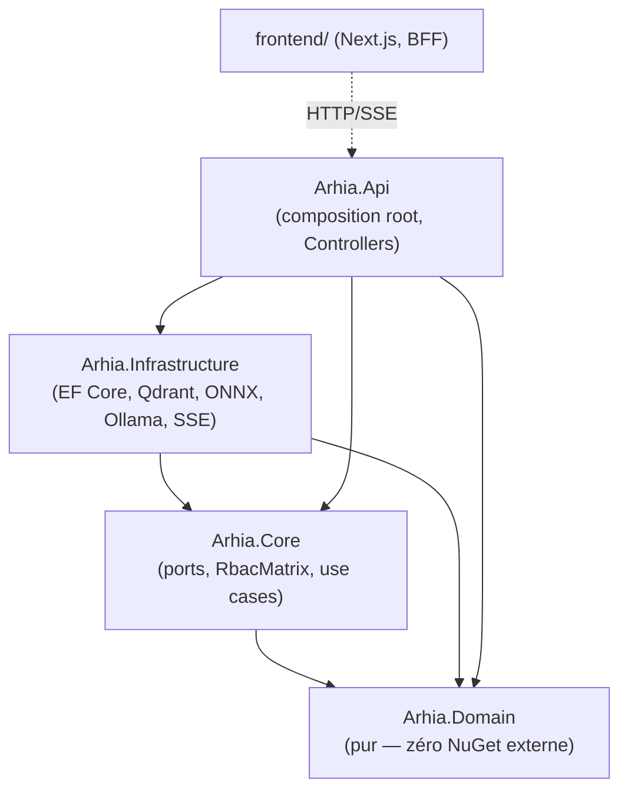
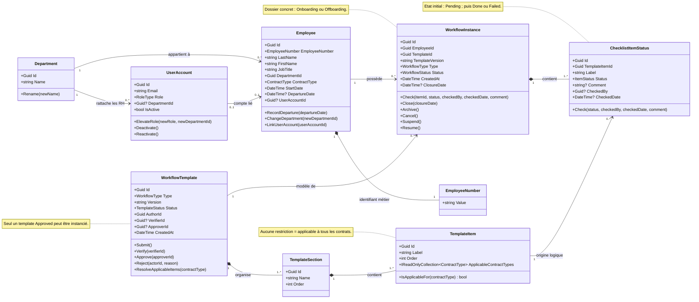
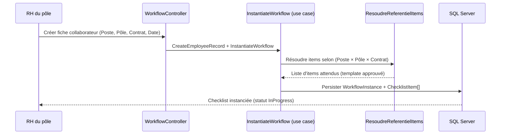
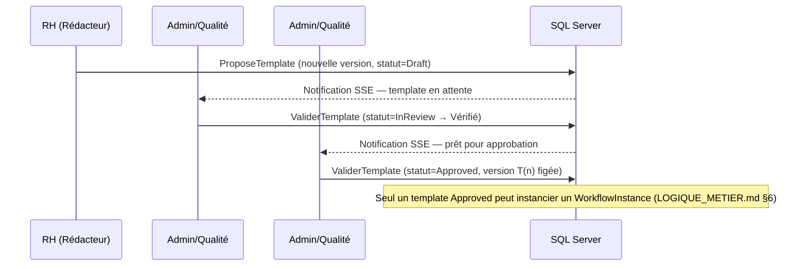
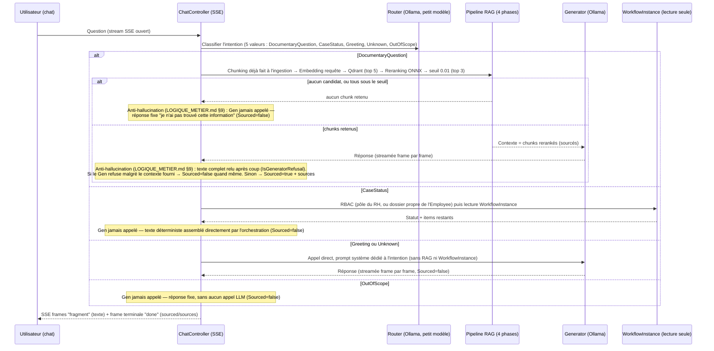
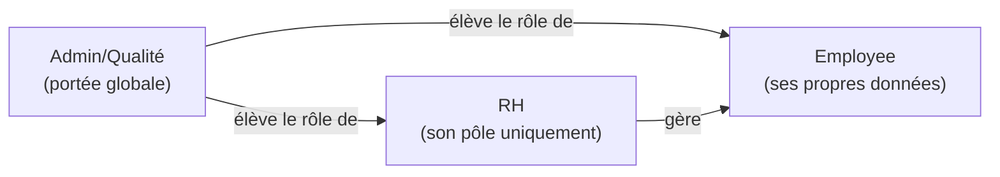

# Architecture — arhia V8

*Document de cadrage suite à `LOGIQUE_METIER.md` et `STACK_TECHNIQUE.md`. Traduit les décisions produit/stack en structure de code concrète (couches, dossiers, ports) et en diagrammes des flux principaux. Document vivant — à ajuster dès que l'implémentation révèle un écart. Sert de référence à `hexagonal-architect` (`.claude/agents/`).*

## 1. Principe hexagonal

Même règle de flèche que V7 (`.claude/agents/hexagonal-architect.md`) : dépendance acyclique, jamais vers le haut.



**Domain** : entités pures — `Employee`, `Department`, `WorkflowTemplate`, `WorkflowInstance`, `ChecklistItem`, `ItemStatus`, `Notification`. Aucune dépendance externe, aucune logique de persistance.

**Core** : ports (interfaces) + use cases + RBAC. Ne connaît que Domain.

**Infrastructure** : un adaptateur par port. Aucune règle métier — traduction mécanique uniquement.

**Api** : composition root (`Program.cs`, DI), Controllers qui orchestrent sans logique métier.

## 2. Arborescence cible

```
src/
  Arhia.Domain/
    Entities/          Employee, Department, WorkflowTemplate, WorkflowInstance,
                        ChecklistItem, ItemStatus, Notification, UserAccount
    ValueObjects/       EmployeeNumber, ContractType, NomPole (readonly record struct)
    Enums/              RoleType (Employee|HR|QualityAdmin), WorkflowStatus
                        (InProgress|Closed|Archived|Cancelled|Suspended), ItemStatus (Done|Failed|Pending),
                        TemplateStatus (Draft|InReview|Approved|Rejected)

  Arhia.Core/
    Ports/              IWorkflowInstanceRepository, ITemplateRepository, IEmployeeRepository,
                        IDepartmentRepository, IVectorSearchPort, IEmbeddingPort, IRerankerPort,
                        ILlmRouterPort, ILlmGeneratorPort, INotificationPort, IAuditTrailPort
    Security/           RbacMatrix (3 rôles), DepartmentScopeGuard (RH → son pôle uniquement)
    UseCases/           CreateEmployeeRecord, InstantiateWorkflow, CheckItem,
                        ProposeTemplate (Rédacteur), ValiderTemplate (Vérificateur/Approbateur),
                        ArchiveCase, ResoudreReferentielItems (Poste×Pôle×Contrat)

  Arhia.Infrastructure/
    Persistence/        ArhiaDbContext (SQL Server, EF Core), implémentations des repositories
    Rag/                MarkdownChunker (structurel + recouvrement), OnnxEmbeddingAdapter,
                        QdrantVectorSearchAdapter, OnnxRerankerAdapter
    Llm/                OllamaRouterAdapter, OllamaGeneratorAdapter
    Realtime/           SseNotificationBroadcaster
    Logging/            TechnicalLogAdapter, AuditTrailAdapter (deux flux séparés, STACK_TECHNIQUE.md §6)

  Arhia.Api/
    Controllers/        AuthController, EmployeeController, WorkflowController,
                        TemplateController, ChatController (SSE), NotificationController (SSE)
    Program.cs           composition root

frontend/
  app/
    (public)/            page de garde
    chat/                 interface post-connexion : chat + barre de notifications
  lib/api/                BFF (cookie httpOnly, jamais le JWT exposé au client)

rag/corpus/                 corpus source du pipeline RAG (6 documents Markdown, milestone 7/9 CHECKLIST.md) —
                            lu par l'adaptateur d'ingestion (Arhia.Infrastructure/Rag/), jamais par le code applicatif directement

tests/
  Arhia.Tests/            xUnit + Moq + FluentAssertions, miroir de la structure Core/Infrastructure/Api
```

**Statut : structure cible, pas encore créée.** Vérifier avec `Glob` avant de supposer qu'un de ces dossiers existe.

## 3. Modèle métier — entités et relations

Le diagramme ci-dessous décrit le modèle réellement porté par `Arhia.Domain/Entities`. Les
cardinalités `1`/`0..1`/`*` indiquent respectivement une relation obligatoire, optionnelle ou
multiple. `TemplateSection` et `TemplateItem` appartiennent à un `WorkflowTemplate` ;
`ChecklistItemStatus` appartient à un `WorkflowInstance` et constitue la copie opérationnelle
d'un item de template au moment de l'instanciation.



Le lien `TemplateItem → ChecklistItemStatus` est une traçabilité logique via `TemplateItemId`.
En revanche, dans le mapping EF Core actuel, les items de checklist sont possédés par
`WorkflowInstance` et cette référence n'est pas configurée comme une clé étrangère vers
`TemplateItem`.

## 4. Flux — création d'un onboarding et checklist



## 5. Flux — circuit de validation d'un template



## 6. Flux — question conversationnelle (RAG + Router/Generator)



## 7. RBAC — schéma de portée



Un RH qui cible un `WorkflowInstance` hors de son pôle → refus (`DepartmentScopeGuard`), avant même la vérification RBAC de rôle. Voir `.claude/agents/secops-guardian.md`.

## 8. Ouvert / en attente

- Nommage exact des migrations EF Core et des collections Qdrant — à fixer à l'implémentation.
- Découpage précis des Controllers si un module grossit (ex. séparer `TemplateController` en lecture/écriture) — non bloquant pour démarrer.
- Les 3 cas particuliers (LOGIQUE_METIER.md §8 : mutation inter-pôle, annulation/suspension, pôle vacant) n'ont pas encore de use case dédié — à ajouter dans `Arhia.Core/UseCases/` une fois leur comportement validé.
