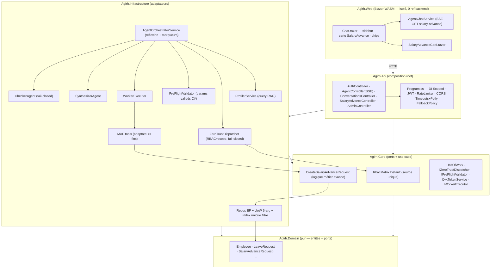

# AGIRH — Audit Architecture Final V5

> **Date :** 31/07/2026 · **Portée :** certification finale (phases 0→6)
> **Verdict :** ✅ **GO** (4/4 audits GO ; 2 réserves secops corrigées puis re-validées build+test)
> **Build :** `0 error(s), 0 warning(s)` · **Tests :** `73/73` (0 failed, 0 skipped)

> **⚠️ MISE À JOUR (05/08/2026)** : document **historique** (certification V5 à 73/73). Depuis : le frontend Blazor **`Agirh.Web` a été supprimé** (remplacé par Next.js `frontend/`), salutations pré-LLM + événement SSE `denied` ajoutés, puis **remédiation modèle R1-R8** — suite de tests **117/117**, build 0/0. Voir `AGIRH_MODEL_AUDIT.md` et `docs/notebooklm/`.

---

## 1. Résumé exécutif

Le pipeline Orchestrator-Worker avec réflexion Actor-Critic, le workflow « Avance sur salaire »
et le Front-end V2 sont certifiés. Toutes les vulnérabilités identifiées dans l'Audit V4
(GO-Conditionnel) ont été corrigées et verrouillées par des tests ; deux écarts de sévérité
modérée découverts pendant la certification finale (`ex.Message` exposé par le WorkerExecutor,
whitelist anonyme implicite) ont été corrigés dans la foulée et re-validés.

| Agent | Périmètre | Verdict |
|---|---|---|
| @ai-rag-specialist | Pipeline, fail-closed, RAG, streaming, marqueurs | ✅ **GO** |
| @secops-guardian | Échappatoire IDOR, RBAC source unique, hygiène, endpoint IDOR, TOCTOU | ✅ **GO** (2 réserves → corrigées) |
| @hexagonal-architect | Domain pur, logique métier extraite, DIP, code mort, graphe | ✅ **GO** |
| @qa-executioner | Build 0/0, 73/73, couverture pipeline, assertions, TOCTOU | ✅ **GO** |

---

## 2. Tableau croisé V4 → V5

| Réf. V4 (dette) | Correctif | Phase | État V5 | Preuve |
|---|---|---|---|---|
| Échappatoire IDOR Manager (cible sans `ManagerId`) | `EvaluateOwnerScope` — null refusé sauf self, Admin exempté | 1.1 | ✅ | `ZeroTrustDispatcher.cs:134,165-175` |
| RBAC 3 sources + dérive `ChecklistFunctions` | `RbacMatrix.Default` seule source (GetToolConfig + ParseAllowedRoles), mapping dur supprimé | 1.2 | ✅ | `ZeroTrustDispatcher.cs:78-98,122-129` ; `ChecklistFunctions.cs:17` |
| Approbation congés sans scope + IDOR Collaborator outils `All` | Scope Manager + IDOR Collaborator (symétrie PayrollFunctions) | 1.3 | ✅ | `LeaveFunctions.cs:37-38,90-98` ; `EmployeeFunctions.cs:31-32` |
| Secrets `appsettings.json` non gitignorés | `appsettings.json` gitignoré + secrets vides, résolution hiérarchique/env | 1.4a | ✅ | `.gitignore:7` ; `appsettings.json:9,12` |
| Absence de rate-limiting | GlobalLimiter bucket+IP : login 5/min, chat 20/min, 429 | 1.4b | ✅ | `Program.cs:52-83,188` |
| CORS AllowAll + ClockSkew défaut | `ProdWhitelist` en prod + `ClockSkew = 1 min` | 1.4c/d | ✅ | `Program.cs:164-172,187` ; `:44` |
| `IsActive` défaut `true` | Fail-closed à l'**extraction** : claim absent → `false` (`HardStateExtractor.cs:30`) — l'entité `Employee.IsActive` garde son défaut `true` (`Employee.cs:65`) | 1.4e | ✅ | `HardStateExtractor.cs:30` ; `Employee.cs:65` |
| Checker fail-open | Fail-closed (4 chemins → `EvaluationResult(false,…)`) | 2.1 | ✅ | `CheckerAgent.cs:76-102` |
| Dernier draft invalide streamé | Garde `lastEvaluation IsValid:false` → message propre, jamais streamé | 2.2 | ✅ | `AgentOrchestratorService.cs:110-115` |
| RAG mort (query jamais produite) | Profiler produit `query` (extraite prioritaire, repli CoreIdea/20 mots) | 2.3 | ✅ | `ProfilerService.cs:186-192` ; `PreFlightValidator.cs:32-37` |
| Timeouts infinis + stream simulé | Timeouts bornés configurés + Polly WaitAndRetry ; zéro `InfiniteTimeSpan` | 2.4 | ✅ | `Program.cs:110-159` |
| Logique métier dans Infrastructure | Use case `CreateSalaryAdvanceRequest` (Core pur) + adaptateur fin | 3.1 | ✅ | `Core/Services/*` ; `PayrollFunctions.cs:12-29` |
| DIP : `IJwtTokenService`/`OllamaEmbeddingGenerator`/`_db` mort | Ports en Core, adaptateurs en Infrastructure, champ supprimé | 3.2/3.3 | ✅ | `Core/Interfaces/IJwtTokenService.cs` ; `Infrastructure/Services/OllamaEmbeddingGenerator.cs` |
| DTOs publics dans contrôleur | Déplacés `Api/Dtos/` | 3.4 | ✅ | `Api/Dtos/ConversationSummaryDto.cs` |
| 0 test pipeline | 32 tests pipeline (Checker/Profiler/Orchestrator/Dispatcher/Chaîne) | 4.1/4.2 | ✅ | `tests/Agirh.Tests/Unit/*` |
| TOCTOU sans garde DB | Index unique filtré `(EmployeeId) WHERE Status='Pending'` + garde app-level conservée | 4.4 | ✅ | `AppDbContext.cs:78` ; migration `20260731182015` |
| Assertions lâches (`ContainAny`) | Assertions exactes + boundaries (5000.01, `employeeId="abc"`) | 4.5 | ✅ | `SalaryAdvanceIntegrationTests.cs` |
| — (nouveau) `ex.Message` exposé via `WorkerExecutor.cs:68` | Message générique client, détail en log serveur | 6 | ✅ | `WorkerExecutor.cs:64-69` |
| — (nouveau) whitelist anonyme implicite | `FallbackPolicy = RequireAuthenticatedUser()` + `[AllowAnonymous]` explicites (login, health) | 6 | ✅ | `Program.cs:50-55` ; `AuthController.cs:24` ; `HealthController.cs:11` |
| Dérive runbook ↔ `/api/admin/ingest` (body vs dossier) | Runbook corrigé (ingestion du dossier entier, log réel) | 6 | ✅ | `AGIRH_SIMULATION_RUNBOOK.md` |

---

## 3. Diagramme d'architecture final (Mermaid)

Chaîne runtime : `AgentController(SSE) → AgentOrchestratorService → Profiler → PreFlight →
ZeroTrustDispatcher(RbacMatrix) → WorkerExecutor → MAF → CreateSalaryAdvanceRequest →
SynthesizerAgent → CheckerAgent(fail-closed) → marqueurs WIDGET/SUGGEST → Token Replay 30ms → SSE`.

---

## 4. Dettes résiduelles assumées (non bloquantes)

1. **IUnitOfWork incomplet** — `KnowledgeDocuments`/`ChecklistItems` hors UoW ; différé car
   l'ajout casserait le helper `BuildTool` 6-arg des tests (à traiter avec l'adaptation du test).
2. **Composition `new` du use case** — `PayrollFunctions.cs:21` (`new CreateSalaryAdvanceRequest(...)`) ;
   passage en DI prévu quand le gel du ctor 3-arg (verrouillé par 3 fichiers de tests) sera levé.
3. **`IsVisibleAsync` dans le contrôleur** — politique d'anti-IDOR du GET avance ; recommandé
   de l'extraire vers un query use case en Core (pas une fuite de couche).
4. **`SynthesizerAgent.cs:74` (`return rawData`) fail-open résiduel** — atténué en aval par le
   Checker fail-closed ; à traiter séparément.
5. **Données métier envoyées au LLM** (`SynthesizerAgent.cs:47`) — data-leakage assumé par design ;
   à auditer avant exposition publique.
6. **Seeds de démo en clair** (`Program.cs:204-207`) — acceptable en dev ; verrouiller en prod
   (`SkipDbInit` + DB initialisée hors dépôt).
7. **Nuances mineures Phase 5** — dédup SUGGEST théorique, comparaison `Ordinal` du WIDGET,
   artefact ~90 ms du SUGGEST en streaming, oracle de timing manager (404), commentaires obsolètes
    des doubles de test, `AgentController.cs:270` (`localhost:11434` en dur).
8. **Pas de dépôt git** — traçabilité par audits + timestamps uniquement ; `git init` recommandé.
9. **`ProfilerTimeout` 600 s (dev)** — généreux mais borné ; 30 s en prod.

---

## 5. État final du système fonctionnel

- **Build :** `dotnet build Agirh.sln` → 0 erreur / 0 warning. *(À l'époque V5 : 6 projets, dont `Agirh.Web` Blazor — projet supprimé depuis, remplacé par `frontend/` Next.js ; il reste 4 projets .NET : Domain, Core, Infrastructure, Api.)*
- **Tests :** `dotnet test Agirh.sln` → **73/73** (9 fichiers + 2 doubles ; couverture des 7
  classes pipeline critiques ; chaîne `amount string→decimal` de bout en bout ; TOCTOU gardé).
- **Pipeline :** fail-closed intégral (Checker, Worker, RBAC, scope) ; RAG opérationnel ;
  streaming Token Replay 30 ms après validation ; marqueurs `||WIDGET:SalaryAdvance:{id}||`
  et `||SUGGEST:...||` déterministes.
- **Sécurité :** RBAC source unique (RbacMatrix), échappatoire IDOR fermé, endpoint avance
  401→403→404 anti-énumération, rate-limiting (429), CORS prod, ClockSkew 1 min, secrets hors
  dépôt, `IsActive` fail-closed, **FallbackPolicy secure-by-default**, `ex.Message` masqué.
- **Front-end :** sidebar d'historique (limites 3/5/7), carte adaptative SalaryAdvance, quick
  replies cliquables, parsing des marqueurs (affichage et historique).
- **Runbook :** `AGIRH_SIMULATION_RUNBOOK.md` à jour (prérequis Ollama/Docker, étapes 0→5,
  critères de succès V5, dépannage).
